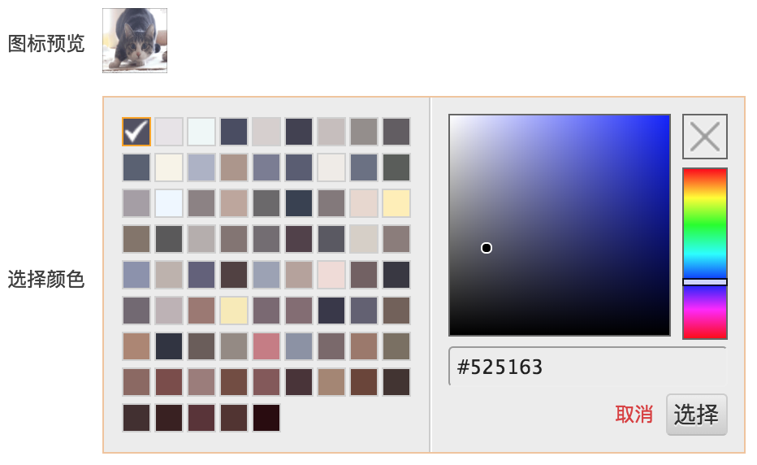
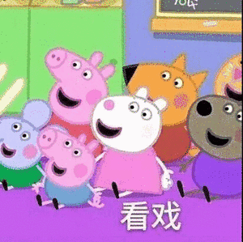
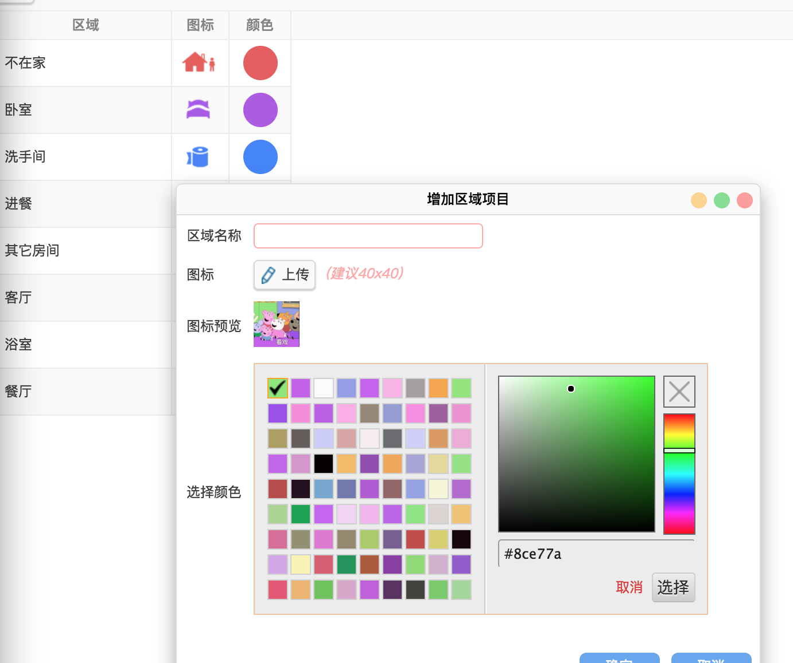

# RGBaster
一个非常简单的Java库，从图像中提取色调。  
JavaScript版本：[rgbaster.js](https://github.com/briangonzalez/rgbaster.js)  


### 用法
##### 示例
```java
import java.awt.Color;
import java.io.File;
import static java.lang.System.*;
import io.github.hulang1024.rgbaster.Colors;
import io.github.hulang1024.rgbaster.Options;
import io.github.hulang1024.rgbaster.Rgbaster;
import io.github.hulang1024.rgbaster.WebColorValueUtils;

Colors colors = Rgbaster.colors( new File(imageDir, "image3.png") );
out.println("  Dominant Color: " + WebColorValueUtils.rgbString(colors.getDominant()));
out.println("  Secondary Color: " + WebColorValueUtils.rgbaString(colors.getSecondary()));
out.println("  Color Count: " + colors.getColorCount());
out.println("  Palette: ");
for (Color c : colors.getPalette()) {
    out.println("\t" + WebColorValueUtils.hexString(c));
}
```

#### 配置选项

##### 示例
```java
Colors colors = Rgbaster.colors(
    imageFile,
    new Options()
        .palette(5000, Color.black)
        .exclude(new Color[] { Color.black, Color.white }));

Colors colors = Rgbaster.colors(
    imageFile,
    new Options()
        .enbalePalette()
        .ignoreAlpha(false)
        .exclude(new Options.ExcludeClosure() {
            public boolean exclude(int color) {
                return new Color(color).getBlue() == 255;
            }
        }));
```


### [API文档](https://hulang1024.github.io/rgbaster/doc/index.html)


### 相关
本项目模块源于做一个自适应背景图片色调的登录按钮的Web系统登录界面，一开始使用了JavaScript版本，但它有一个延迟。  
本Java版本增加了一些特性。  

**运用例子截图：**  







License
-------
MIT
